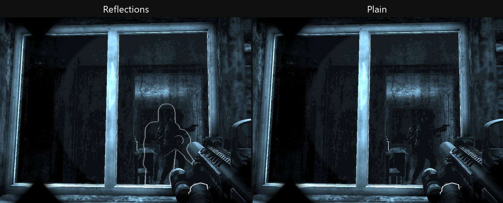
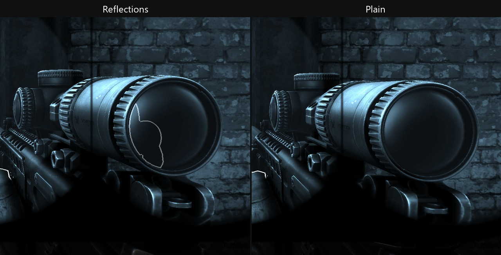
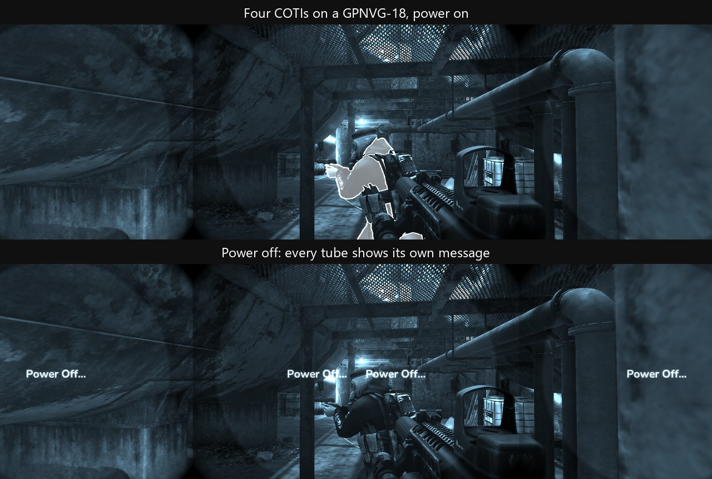
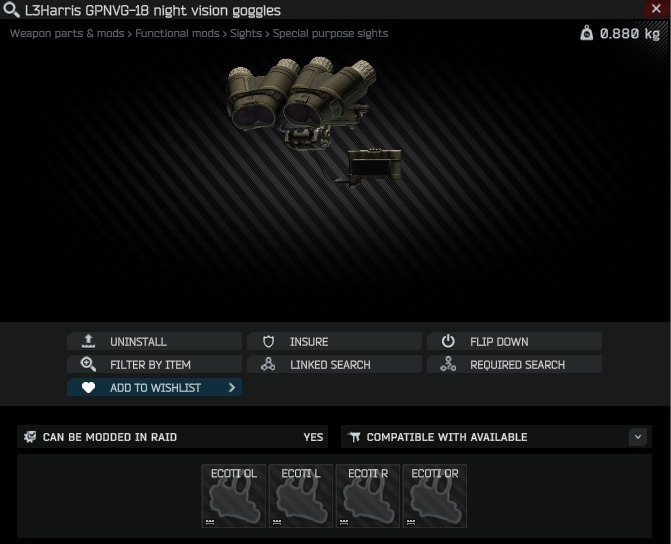

# COTI - Clip-On Thermal Imager

A clip-on thermal imager for **SPT 4.1**. SPT 4.0 stays on 2.0.2, the last release of that line.
It clamps to the objective of a night vision device and
injects a thermal overlay **into the tube's circle**, so heat signatures stand out while the night
vision image shows through everywhere else - the way a real fused clip-on works, rather than
replacing your view with a thermal one.

Modelled on the Safran DSI AN/PAS-29B.

---

## What it does

- **Fused, not switched.** The thermal image is added inside the night vision circle only. Anything
  cooler than the heat threshold contributes exactly nothing, so the tube image stays readable.
- **Heat from what is actually happening, read against the air.** Each thing's heat comes from its
  state in the raid: people read at their body temperature, burning fires read hot, and a barrel or
  suppressor heats only from firing. What draws is how much hotter than the air it is, so people
  stand out most on a cold night and less on a hot day, and cultists, only a little above the air,
  are faint everywhere. Corpses keep the heat they had at death, as on the game's own T-7. Unlit
  lamps, unlit fire barrels, grenades, blood, tritium sights and glossy surfaces stay dark.
- **Glass blocks heat, and reflects it.** A window hides anything warm behind it. With `Glass` on
  `Reflections`, the default, the pane also mirrors the people in front of it, you included: faint
  face-on, strong at a shallow angle. A magnified scope's own front and eyepiece glass do the same,
  so your eyepiece seen from outside shows your head and shoulders. Red dots and holographic sights
  are never glass.

  

  

- **Lamps.** A lit searchlight reads hot at its lens and warm around its head; a lit flashlight
  reads faintly warm from its lens back. Every other lamp stays cold, and so do lasers and infrared
  illuminators. The searchlights that heat are listed in `lamps.json` beside the DLL.
- **Two modes.** Outline draws the edges of hot things; Full fills them in. `Alt+N` switches between
  them, and the display names the new mode with the calibration click.
- **Through a scope.** With `Magnify With Optic` on, heat is drawn through a magnified scope's own
  lens at the scope's zoom, so it lines up with what the scope shows. Behind a thermal sight such as
  the REAP-IR or the RS-32, the imager stands down and the sight's own picture is left alone.
- **Its own power.** `Ctrl+N` toggles the imager independently of the goggles, like the real device's
  own button. The night vision stays on when the thermal goes off. Powering up shows the device's
  own `Initializing...`, then the thermal arrives with the core's calibration click; powering down
  shows `Power Off...`. Switch the sequence off in F12 for an instant toggle.
- **Mounts to the game's own goggles** - PVS-14, N-15, GPNVG-18, PNV-10T and PNV-57E - each with its
  own tuned position. Goggles from other mods are covered by addon files (see `ADDONS.md`). A device
  whose mod is not installed is skipped silently.
- **Other players see it on you.** It renders on your head in third person and is hidden from your
  own first-person view, using the game's own mechanism for worn gear.
- **Found where night vision is found.** It spawns in the same containers and loose-loot positions
  as the goggles it clips to, at a fraction of their rate, and is sold by Peacekeeper. Bots don't
  carry it by default; `loot.onBots` lets them.

## A COTI on every tube

Every tube of a goggle takes its own COTI, in any combination from one to four: four on a GPNVG-18
or Argus Chimera, two on an N-15, PNV-57E, DTNVS, PVS-31A, PVS-31 or AN/PVS-5A, one on a PVS-14 or
PNV-10T. Each tube's circle lights only when that tube carries a COTI, and overlapping circles do
not double the heat. `Ctrl+N` and `Alt+N` drive them all together.



The slots are named by position and listed left to right:

| Goggle | Slots |
|---|---|
| Quad (GPNVG-18, Argus Chimera) | ECOTI OL, ECOTI L, ECOTI R, ECOTI OR |
| Dual, and the AN/PVS-5A | ECOTI L, ECOTI R |
| Mono (PVS-14, PNV-10T) | ECOTI |



ECOTI R is the slot a single COTI always used, so one already fitted stays where it is, and a single
COTI dropped onto a goggle still lands there. More COTIs fill the centre pair first, then the outer
tubes. Each circle is centred in BorkelRNVG's tube hole, measured from his masks at their default
size, so there is nothing to tune.

On a C11 True North goggle whose pods fold separately (True North 4.0.20 or later), flipping one pod
up switches off that pod's COTIs while the other stays lit.

**Before going back to an older COTI**, or to an older single-tube addon file, take the extra COTIs
off. COTIs in ECOTI L, OR or OL are lost after one saved raid, with no error.

## Requirements

- **SPT 4.1.** SPT 4.0 stays on 2.0.2, which gets no new features.
- **Borkel's Realistic NVGs - recommended, not required.** Nothing here depends on it. It is
  recommended because it gives night vision the masked, feathered tube the overlay is designed to sit
  inside; on vanilla night vision the effect still works but sits in a plainer picture. The circles
  assume Borkel's default mask size: changing his Mask size multiplier moves his holes but not COTI's
  circles.

## Installing

Server half → `SPT_Runtime/user/mods/LennoxP90-COTI/` (4.1) or `SPT/user/mods/LennoxP90-COTI/` (4.0)
Client half → `BepInEx/plugins/LennoxP90-COTI/` (same path on both versions)

Both halves are needed on either version: the server registers the item, its slot on each night
vision device, and the trader offer; the client does the rendering.

## Building

Building the server half needs reference assemblies from **both** an SPT 4.0 install and an SPT 4.1
install - it targets both `net9.0` and `net10.0` and validates both reference sets up front:

```
dotnet build Coti.Server -c Release -p:SptRef40Dir=<path to your SPT 4.0 install> -p:SptRef41Dir=<path to your SPT 4.1 install>
```

If you only have one install, build just that target framework instead of failing on the other:

```
dotnet build Coti.Server -c Release -f net10.0
```

The client half builds against a live game install and takes the SPT generation as a property.
Both client builds are `net472`, so MSBuild cannot multi-target them - build the project twice,
once per version:

```
msbuild Coti.Client\Coti.Client.csproj -p:Configuration=Release -p:SptTarget=4.1
msbuild Coti.Client\Coti.Client.csproj -p:Configuration=Release -p:SptTarget=4.0
```

`SptTarget` defaults to `4.1` if omitted. `SptRoot` defaults sensibly for each target
(`F:\Games\SPT-4.1\SPT-4.1-client` and `F:\Games\SPT-4.0\Clean` respectively) but can be overridden:

```
msbuild Coti.Client\Coti.Client.csproj -p:Configuration=Release -p:SptTarget=4.0 -p:SptRoot=<path to your SPT 4.0 client>
```

`SptRoot` is the folder holding `EscapeFromTarkov.exe`; the client half references the game's
assemblies from `EscapeFromTarkov_Data\Managed` and `BepInEx\plugins\spt` beneath it. The two
builds compile different `#if` paths against different, differently-obfuscated game assemblies - their
output DLLs are never byte-identical, and the build stages each one into its own
`spt-4.0`/`spt-4.1` root so one target can never overwrite the other.

Both projects stage themselves into `dist\<Configuration>\spt-4.0\` and `dist\<Configuration>\spt-4.1\`,
laid out so the contents of each drop straight into the matching SPT folder. `bundles\` holds the
prebuilt Unity artifacts; the Unity project that produces them is not part of this repository, since
the model it embeds is licensed rather than free.

## Settings

Image and control settings are on the **F12** page. What the item costs and how often it turns up
are server-side, in `SPT_Runtime/user/mods/LennoxP90-COTI/config/config.json` - a server restart applies them.

| Setting | |
|---|---|
| `trader.loyaltyLevel` / `priceUsd` / `buyLimit` | Peacekeeper's offer. Defaults to LL4, $2000, three per profile. |
| `loot.enabled` | Turn off to make the trader the only source. |
| `loot.weightFraction` | Spawn weight relative to the night vision already at each spot. `0.25` makes it a quarter as likely as the goggles themselves. |
| `loot.onBots` | Off by default, so bots never carry a COTI. With Acid's Progressive Bot System, on means every bot that spawns with night vision at night has one on every tube. |
| `flea.playerSellable` | Off by default, so the only flea listing is Peacekeeper's own, at `priceUsd`. On also lets SPT list simulated player offers and lets players sell their own. SPT prices those listings itself, not from `priceUsd`: expect roughly two to three times Peacekeeper's price. |

The F12 page:

| Section | Setting | |
|---|---|---|
| **Image** | Enabled | Master switch. Safe to toggle any time, including mid-raid. |
| | Heat Threshold | How hot something must be before it shows. Raise it if the overlay washes the picture out; lower it to pick up cooler things. |
| | Overlay Intensity | Brightness of the heat that does show. Lower it if bodies read as solid white blobs rather than shapes. |
| | Full Mode Fill (%) | How bright Full mode fills a hot shape inside its outline. Default 45; 100 is a solid shape; Outline mode ignores it. An install still holding the old default of 55 moves to 45 once. |
| | Glass | Default `Reflections`. Glass blocks heat either way. `Plain` draws the pane blank; `Reflections` also mirrors the bodies in front of it, you included. Measured free, so pick by taste. |
| | Scope Glass Reflections | On by default. A magnified scope's front and eyepiece glass reflect like a window while Glass is on Reflections; off, scope glass stays plain. Measured free. |
| | Heat Brightness | Default 1, from 0.25 to 2. Dims or brightens how heat draws without changing what is detected. |
| | Magnify With Optic | Off by default. On draws the heat through a magnified scope's lens at the scope's zoom, at the cost of a second render while aiming: 0.13 ms a frame on, against 0.05 ms off, on the empty test range below. **Potential FPS improvement:** leave it off. |
| | Render Flashlight Heat | On by default. A lit flashlight's head shows faintly warm, from its lens back; lasers and infrared illuminators stay cold. Off, every flashlight reads cold. Not measured on its own; a preference. |
| | Render Searchlight Heat | On by default. A lit searchlight shows hot at its lens and warm around it; every other lamp stays cold. Off, searchlights read cold too. Measured free: with 1000 lit searchlights in view, turning it off moved the median frame from 3.51 ms to 3.50 ms. |
| | Sensor Refresh (Hz) | The thermal image updates at this rate and holds in between, as a real low-refresh core does. Default 60; 0 updates every frame and costs the most. Measured on 3.2.0 at 1x: 0.25 ms a frame at 0, against nothing measurable at 60. The saving shrinks at lower frame rates. **Potential FPS improvement:** keep it at 60 or lower. |
| **Controls** | Power Toggle | Click and press the combination you want. Default `Ctrl+N`. Keep a modifier - EFT does not demand an exact match on its own binds, so a bare `N` would toggle the goggles too. |
| | Mode Toggle | Switches Outline and Full. Default `Alt+N`. |
| | Thermal Mode | The mode the device powers up in. Mode Toggle changes it. |
| **Power Sequence** | Enabled | On by default. Off makes `Ctrl+N` switch the thermal instantly, with no messages and no click. |
| | Initializing / Warm-up Gap / Power Off Seconds | How long each stage lasts. Defaults 1.2, 0.3 and 1.5 - a little quicker than the real device. |
| | Click Volume | The calibration click, on top of the game's own volume. 0 mutes it. |
| **Debug** | Verbose Logging | Off for normal play. Writes detailed diagnostics to the BepInEx log if you are reporting a problem. |

Deliberately not exposed: the per-device mask geometry and the mount poses. Those are not preferences, they are measured values - exposing them mostly
offers a way to break the effect.

## Performance

The imager renders the scene a second time, off-screen, and composites the result inside the tube.
That pass runs only while the device is powered on and clipped to a host, and it is built to cost as
little as possible:

- **A heat-only shader.** The thermal camera draws each surface once, in a single unlit pass that
  writes its heat or black, instead of a full lit render plus the game's thermal post-processing.
- **Rendered at the sensor's rate.** The image updates at `Sensor Refresh` (60 Hz) and holds in
  between; at a high frame rate most frames render nothing.
- **Only the circles.** The camera renders just the part of the view inside the tubes' circles.
- **One camera at a time.** While a magnified scope draws its own heat, the 1x camera rests.
- **Culled like your eyes.** The thermal skips what the main view would cull at the same distance.
- **No world scans mid-raid.** Things register as they appear, and the one-off setup runs during the
  deploy countdown.

Measured on SPT 4.1, same install and scene, an empty test range at about 330 fps, median of three
runs. Cost is COTI's own, over the same view with it off:

| With the imager on | 3.1.0 | 3.3.0 |
|---|---|---|
| Frame time at 1x | 0.46 to 0.53 ms | 0.02 to 0.06 ms |
| Frame time through a magnified scope | 0.60 to 0.67 ms | 0.13 ms |
| Frame time through a scope, Magnify With Optic off | 0.32 ms | 0.05 ms |
| GPU time | 0.22 to 0.51 ms | nothing measurable |

That range is the imager's lightest case, with no terrain and few bodies; a full map costs more. On
Streets the 1x thermal scene still costs about 2.6 to 2.8 ms of GPU time at the view tested.

Other measurements:

- **Hitches.** On Streets with bots, frames over 50 ms in the two minutes after the first
  flip-down went from about 30 to none. The stall on the first flip-down and the hitches every 10
  and 30 seconds are gone.
- **Reflections.** With ten bodies mirrored in a pane filling the view, the frame took 4.62 ms on
  Reflections against 4.61 ms on Plain. Scope glass cost the thermal camera 0.03 ms, the same as a
  holographic sight.
- **More COTIs.** Four against one on Customs added about 0.2 ms a frame and 0.27 ms of GPU, inside
  the run-to-run spread of a single COTI.

## Credits

**3D model by [3DMA - 3D Military Assets](https://www.3dmilitaryassets.com/)**, used under their
Extended Licence.

Thanks to Eukyre for pointing out that worn gear wants a dress script - that turned out to be
exactly how the device is hidden from the wearer's own view.

## Licence

The mod's own code is free to use. The 3D model is **not** - it is licensed from 3DMA and is
redistributed only in compiled form inside the asset bundle, as their licence permits. Do not
extract, redistribute, or reuse the model, its mesh or its textures.
